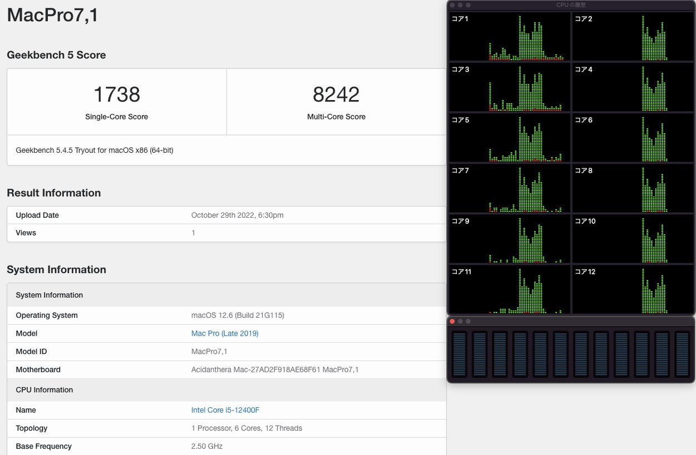
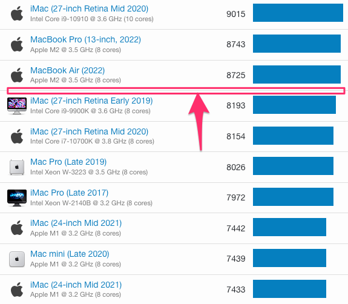
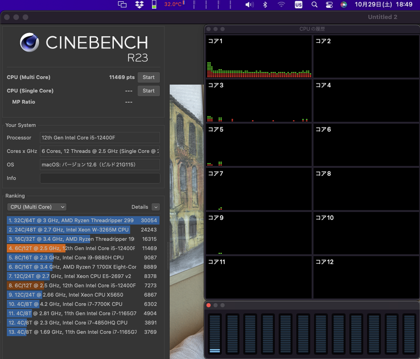
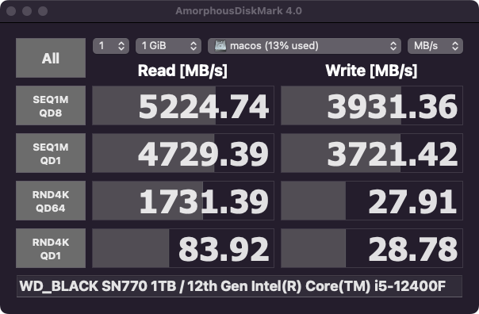

# ASRockZ690M-ITX-ax_i5-12400F_RX6600
### OpenCore Hackintosh
```
CPU    Intel Core i5 12400F BOX
MB     ASROCK ASRock  (DDR4)  Z690MITXax
RAM    Team PC4-28800 (DDR4-3600） 32GB（16GB×2枚）
VIDEO  Radeon RX6600 8GB
SSD1   Team M.2 2280 NVMe PCIe Gen3x4 SSD MP33シリーズ 512GB
SSD2   Western Digital WD Black SN770 WDS100T3X0E (M.2 2280 1TB)
CASE   ZZAW Braveman B2 Mini ITX Case							
FUN    ALSEYE M240 White 240mm
POWER  Cooler Master フルモジュラー式 650W SFX PC電源
WiFi   BCM94360NG ngff M.2 802.11AC bluetooth 4.0カード
```

### Benchmark









### 